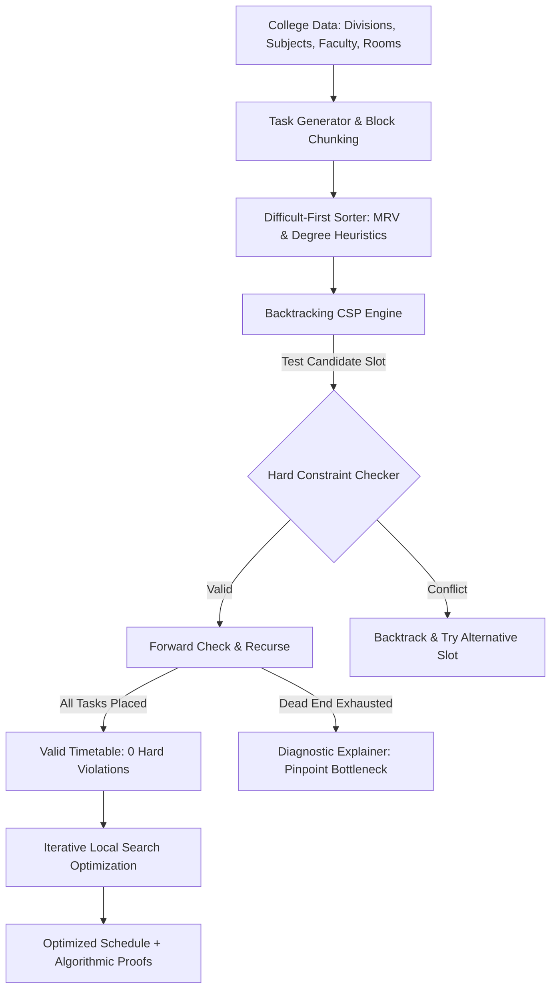
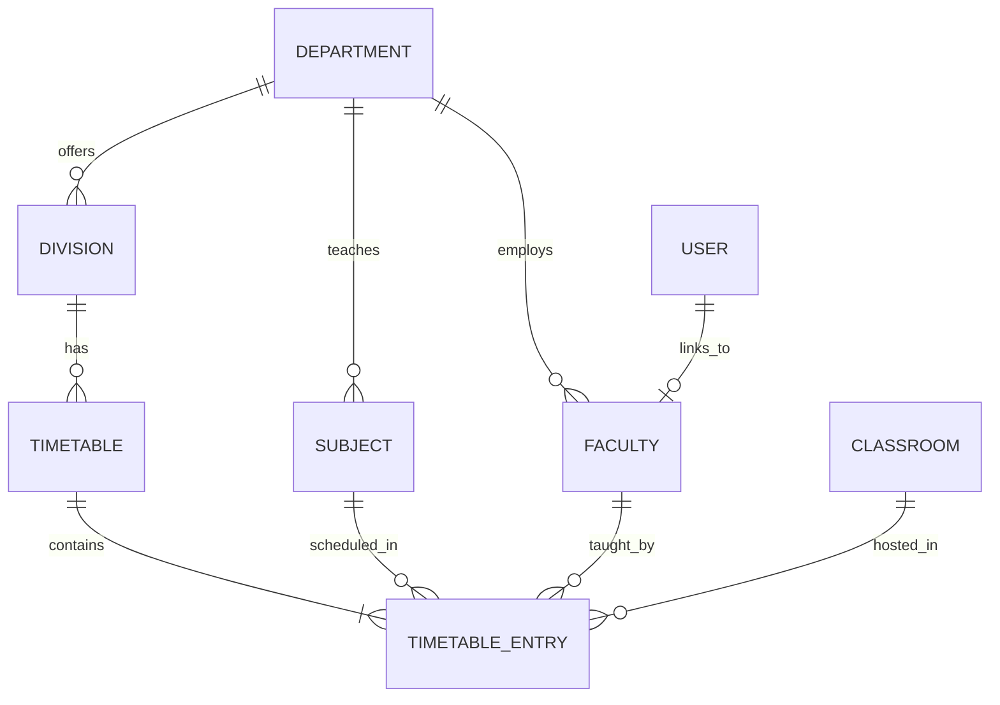

# SmartSchedule — Intelligent College Timetable Generator

SmartSchedule is an enterprise-grade full-stack MERN application that generates and manages complex college academic timetables. Powered by an intelligent **Constraint Satisfaction Problem (CSP)** engine with **Backtracking search**, **Minimum Remaining Values (MRV)** heuristics, and **Local Search Optimization**, the application guarantees zero hard-constraint violations while minimizing scheduling gaps and distributing teaching workloads fairly.

---

## 1. Project Overview & Business Problem

### The Business Challenge
In higher education institutions, timetable generation is an NP-complete scheduling challenge:
- Colleges operate across multiple departments, divisions, semesters, subjects, classrooms, laboratories, and faculty members.
- Manual scheduling leads to teacher double-booking, room collisions, capacity breaches, and curriculum violations.
- When resource constraints cannot be met, manual schedulers fail without explaining *why* the schedule is impossible or *what* resource is causing the bottleneck.

### The Solution
SmartSchedule replaces trial-and-error with a mathematical constraint solver written in pure JavaScript:
1. **Zero Double-Booking**: Enforces strict mutual exclusivity across faculty, classrooms, and student cohorts.
2. **Specialized Lab Allocation**: Dedicated 2-period contiguous blocks strictly assigned to qualified laboratory facilities.
3. **Capacity Matching**: Classroom seating capacity is strictly verified against division student strength.
4. **Intelligent Failure Explanations**: When constraints conflict, the engine diagnoses the exact failure reason (e.g. lab saturation, faculty unavailability) and provides actionable administrative recommendations.

---

## 2. Architecture & Pipeline



---

## 3. Technology Stack

- **Frontend**:
  - React 18
  - Vite
  - JavaScript (ES Modules)
  - Tailwind CSS
  - React Router v6
  - Axios
  - Lucide React Icons
- **Backend**:
  - Node.js (v20+ / v24)
  - Express.js
  - Mongoose
  - JSON Web Tokens (JWT)
  - bcryptjs
  - dotenv, cors, morgan
- **Database**:
  - MongoDB Atlas (or local MongoDB)
- **Scheduling Algorithm**:
  - Pure JavaScript Constraint Satisfaction Problem (CSP) solver
  - Recursive Backtracking with Forward Checking
  - Minimum Remaining Values (MRV) Difficult-First heuristic
  - Local Search Neighborhood Swap Optimizer
  - *No Machine Learning, No Python, No external solver binaries*

---

## 4. Hard vs. Soft Constraints

### Hard Constraints (Zero Violations Permitted)
1. **Faculty Conflict**: A teacher cannot teach two classes at the same day and period.
2. **Classroom Conflict**: A room cannot host two classes at the same day and period.
3. **Division Conflict**: A division cohort cannot attend two subjects at the same time.
4. **Room Capacity**: Classroom seating capacity must be $\ge$ division student count.
5. **Lab Requirement**: Practical courses requiring laboratories must never be assigned standard classrooms.
6. **Faculty Availability**: Faculty cannot be scheduled during periods explicitly marked as unavailable in their availability matrix.
7. **Classroom Availability**: Rooms cannot be booked during maintenance or reserved periods.
8. **Required Weekly Quota**: Every subject must have its exact `weeklyPeriods` scheduled.
9. **Consecutive Block Integrity**: 2-period practical sessions must occur in contiguous slots on the same day without crossing break periods.

### Soft Constraints (Quality Optimization Metric)
Soft constraints optimize schedule comfort and retention:
$$\text{Penalty} = w_1 \times \text{facultyGaps} + w_2 \times \text{studentGaps} + w_3 \times \text{excessiveConsecutive} + w_4 \times \text{subjectClustering} + w_5 \times \text{afternoonLab}$$
- **Faculty Gaps**: Minimizes idle hours between classes for teachers on the same day.
- **Student Gaps**: Avoids hollow gaps in student daily routines.
- **Excessive Consecutive Classes**: Penalizes >3 consecutive periods without a break.
- **Subject Distribution**: Prevents clustering identical theory subjects on the same day.
- **Morning Lab Preference**: Favors scheduling complex practical labs during fresh morning hours.

---

## 5. Difficult-First Scheduling & Backtracking Explanation

### Why Difficult-First?
In constraint programming, scheduling the most flexible task first leads to combinatorial explosion. SmartSchedule orders tasks by difficulty before search begins:
1. **Multi-period Practical Labs**: Require 2 contiguous slots in scarce specialized lab facilities with qualified faculty.
2. **Minimum Remaining Values (MRV)**: Tasks with the fewest qualified classrooms or teachers are scheduled first.
3. **High-Frequency Courses**: Subjects needing 4–5 weekly periods are placed before low-frequency electives.

### Backtracking Mechanism
When the solver hits a dead end (no valid slot remains for Subject $C$ due to room contention):
1. The solver unassigns Subject $C$.
2. It steps back to Subject $B$, restores Subject $B$'s previously occupied slots in the occupancy sets, and tests $B$'s next best candidate slot.
3. Search resumes forward to re-evaluate Subject $C$.
4. Safety bounds (step counters and timeouts) prevent infinite loops.

---

## 6. Impossible Timetable Handling & Diagnosis

When constraints make a conflict-free schedule mathematically impossible, SmartSchedule does not simply fail. The diagnostic analyzer evaluates:
- **Total Slot Deficit**: If curriculum weekly periods exceed available active periods in the academic week.
- **Laboratory Saturation**: If cohort size exceeds all lab capacities, or if existing divisions have fully booked all qualifying lab hours.
- **Teacher Availability Bottleneck**: If a teacher's remaining free hours are fewer than the division's required course periods.

### Structured Diagnostic Output Format
```json
{
  "problem": "No qualifying laboratory exists for Division ISE-OVERSIZE.",
  "affectedDivision": "ISE-OVERSIZE",
  "subject": "DBMS Lab, Web Development Lab",
  "requiredRoom": "Laboratory (Capacity >= 95)",
  "reason": "Division has 95 students. Existing laboratories have a maximum capacity of 65.",
  "suggestedActions": [
    "Increase capacity of existing laboratories to at least 95.",
    "Split Division into smaller laboratory batches (Batch A and B).",
    "Register a new laboratory facility with sufficient student capacity."
  ]
}
```

---

## 7. Database Schemas (Mongoose)



### Models Summary
- **User**: `name`, `email`, `passwordHash`, `role` (`ADMIN`, `FACULTY`), `facultyProfile`.
- **Department**: `name`, `code`, `description`.
- **Division**: `name`, `department`, `semester`, `academicYear`, `studentCount`.
- **Faculty**: `name`, `employeeId`, `department`, `subjects`, `availability` (day/period array), `maxWeeklyHours`.
- **Subject**: `name`, `code`, `department`, `type` (`THEORY`, `LAB`, `TUTORIAL`), `weeklyPeriods`, `requiresLab`, `preferredConsecutivePeriods`, `facultyEligible`.
- **Classroom**: `name`, `roomNumber`, `type` (`CLASSROOM`, `LAB`), `capacity`, `building`, `floor`, `availability`.
- **TimeSlot**: `day`, `periodNumber`, `startTime`, `endTime`, `isBreak`, `label`.
- **Timetable**: `academicYear`, `semester`, `division`, `entries`, `generationStats`, `optimizationHistory`, `status`.
- **GenerationLog**: `requestedAt`, `requestedBy`, `division`, `success`, `hardConstraintViolations`, `generationTime`, `explanation`, `failedReason`, `suggestedActions`, `diagnostics`.

---

## 8. REST API Structure

| Method | Endpoint | Description | Role |
| :--- | :--- | :--- | :--- |
| `POST` | `/api/auth/register` | Register administrator or faculty user | Public |
| `POST` | `/api/auth/login` | Authenticate and obtain JWT token | Public |
| `GET` | `/api/auth/me` | Fetch active user profile | Authenticated |
| `GET` | `/api/departments` | List all departments | Authenticated |
| `POST` | `/api/departments` | Create new department | ADMIN |
| `GET` | `/api/divisions` | List all divisions | Authenticated |
| `POST` | `/api/divisions` | Create student division | ADMIN |
| `GET` | `/api/faculty` | List faculty with availability | Authenticated |
| `PUT` | `/api/faculty/:id/availability` | Update teacher availability matrix | ADMIN / FACULTY |
| `GET` | `/api/subjects` | List courses and lab requirements | Authenticated |
| `GET` | `/api/classrooms` | List rooms and laboratory capacities | Authenticated |
| `GET` | `/api/timeslots` | List daily period intervals | Authenticated |
| `POST` | `/api/timeslots/initialize` | Initialize Mon–Fri (6 periods/day) | ADMIN |
| `POST` | `/api/timetables/generate` | Run backtracking generator | ADMIN |
| `POST` | `/api/timetables/validate` | Validate schedule against hard constraints | Authenticated |
| `POST` | `/api/timetables/optimize/:id` | Run local search optimization | ADMIN |
| `GET` | `/api/timetables` | List active timetables | Authenticated |
| `GET` | `/api/conflicts` | Fetch real-time system conflicts | Authenticated |
| `GET` | `/api/reports` | Get faculty workload & room utilization | Authenticated |
| `GET` | `/api/generation-logs` | Retrieve audit trail history | Authenticated |
| `GET` | `/api/health` | Service and MongoDB status | Public |

---

## 9. Setup & Installation Instructions

### Prerequisites
- **Node.js**: v20.x or v24.x
- **npm**: v10.x or v11.x
- **MongoDB Atlas account** (or local MongoDB daemon)

### 1. Clone & Configure Environment Variables
Inside `backend/.env`:
```env
PORT=5000
MONGODB_URI=
JWT_SECRET=
CLIENT_URL=http://localhost:5173
```
> [!IMPORTANT]
> Paste your MongoDB Atlas URI into `backend/.env`:
> `MONGODB_URI=mongodb+srv://<username>:<password>@cluster0.mongodb.net/smartschedule?retryWrites=true&w=majority`

### 2. Install Dependencies
```bash
# In backend
cd backend
npm install

# In frontend
cd ../frontend
npm install
```

### 3. Seed Database
Once your `MONGODB_URI` is added in `backend/.env`:
```bash
cd backend
npm run seed
```
This populates:
- 3 Academic Departments (ISE, CSE, ECE)
- 4 Divisions: `ISE-A` (60 students), `ISE-B` (55 students), `CSE-A` (65 students), and `ISE-OVERSIZE` (95 students - intentional conflict test)
- 8 Faculty members with individual availability matrices
- 9 Subjects (7 Theory + 2 Practical Labs with 2-period blocks)
- 5 Classrooms (capacity 60–80) and 2 Specialized Computer Labs (capacity 60–65)
- Standard Monday–Friday time slots (6 periods/day)
- Seed Accounts:
  - **Admin**: `admin@smartschedule.edu` / `Admin@123`
  - **Faculty**: `priya.sharma@smartschedule.edu` / `Faculty@123`

### 4. Run the Test Suite
The core scheduling algorithm can be tested independently of any database:
```bash
cd backend
npm test
```
All 15 automated unit/integration tests will execute using Node's native test runner.

### 5. Start Development Servers
In Terminal 1 (Backend):
```bash
cd backend
npm run dev
```

In Terminal 2 (Frontend):
```bash
cd frontend
npm run dev
```
Open your browser at `http://localhost:5173`.

---

## 10. Interview Demonstration Guide

1. **Sign In**:
   - Navigate to `/login`. Click **"Admin Demo"** to auto-fill `admin@smartschedule.edu` / `Admin@123`.
2. **Explore Dashboard**:
   - Inspect the 8 KPI cards, facility utilization previews, and CSP pipeline summary.
3. **Generate Valid Timetable**:
   - Navigate to **"Generate Timetable"**.
   - Select Division **`ISE-A`**, configure soft constraint preferences, and click **"Generate Timetable"**.
   - Observe solver completion duration (~10–30ms), zero hard violations, and grounded verification proofs.
4. **View Multi-Perspective Timetable Grid**:
   - Open **"Timetables"**.
   - Switch between **Division View**, **Faculty View** (filter by teacher), and **Classroom View** (filter by lab/lecture hall).
   - Test **CSV Export** and **Print Timetable**.
5. **Demonstrate Impossible Conflict Diagnosis (Requirement 13 & 25)**:
   - Navigate back to **"Generate Timetable"**.
   - Select Division **`ISE-OVERSIZE`** (95 students).
   - Click **"Generate Timetable"**.
   - The engine halts and outputs the structured diagnostic report:
     * *Problem*: No qualifying laboratory exists for Division ISE-OVERSIZE.
     * *Reason*: Cohort has 95 students, but maximum laboratory capacity is 65.
     * *Action*: Recommends splitting division or commissioning larger facilities.
6. **Validate & Optimize**:
   - In **"Timetables"**, click **"Validate Constraints"** to verify 0 violations.
   - Click **"Optimize Soft Score"** to run local search neighborhood swaps and observe real penalty score reduction (e.g. 48 $\to$ 24).
7. **View Analytical Reports & History**:
   - Visit **"Reports"** for teacher workload percentages and room utilization rates.
   - Visit **"Generation History"** to review the complete audit trail.
